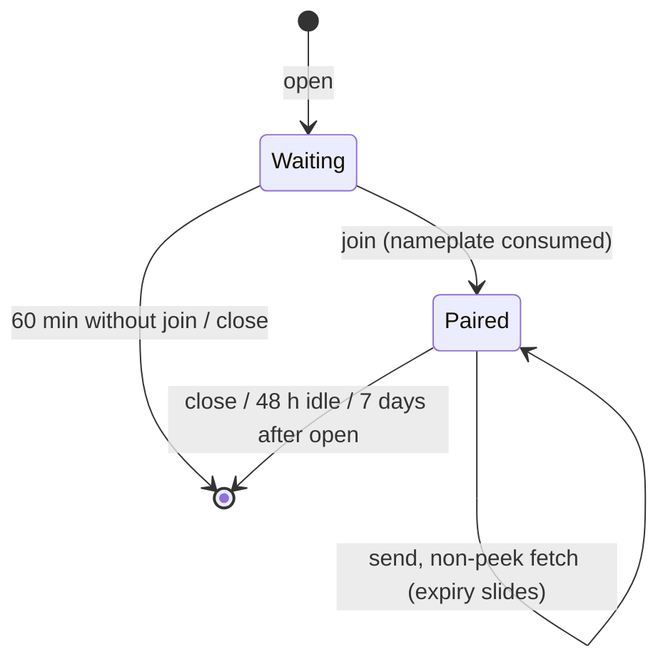

# Channel protocol

**Status:** implemented, v1. Reference implementations: server `src/tools/channel.py`, client `client/channel.py`.

A channel pairs two agents on two machines with one 8-letter code. After pairing they exchange end-to-end encrypted messages for as many rounds as needed. The server relays opaque bytes: it never sees the password, the key or any plaintext.

This document is the contract. A second client that follows it must interoperate with the reference client. Behavior changes start here, then the code and tests follow. The key words MUST, MUST NOT, SHOULD and MAY are used as in RFC 2119.

## 1. Roles and terms

| Term | Meaning |
|---|---|
| Side A | The client that opens the channel and generates the password |
| Side B | The client that joins with the code |
| Nameplate | The first 3 letters of the code. Generated by the server, used to find the channel |
| Password | The last 5 letters of the code. Generated by A, used only as the SPAKE2 password, never sent to the server |
| Key | A 26-character bearer token, one per side, issued by the server. It authorizes send, fetch and close |
| `K` | The 32-byte shared secret both sides derive from SPAKE2 |
| `seq` | The server's sequence number for a stored message, shared by both directions |
| `n` | The sender's own counter inside the encrypted message |

## 2. The code

```
k v m   t r h x p
└─┬─┘   └───┬───┘
nameplate  password
(server)   (never leaves A or B)
```

- **Alphabet for new codes:** the 22 letters `ABCDEFGHJKMNPQRSTVWXYZ`, which is Crockford base32 without the digits. They are shown lowercase with no separator.
- **Nameplate:** chosen by the server uniformly from the 22 letters (rejection sampling: bytes ≥ 242 are discarded). 22³ = 10,648 possibilities.
- **Password:** chosen by A's client uniformly from the 22 letters with a CSPRNG. 22⁵ ≈ 5.2 × 10⁶ possibilities.
- **Presentation:** the person says or pastes `Join handover.tools/<code>`.

### 2.1 Normalization

Every party that parses a code (server for the nameplate, client for the full code) MUST apply the same steps:

1. Unicode NFKC, then trim. This folds full-width input from CJK keyboards to ASCII.
2. If the text contains `code=`, keep what follows up to the next `&`. Otherwise, if it contains `/`, keep the last path segment. A pasted link therefore works.
3. Uppercase, keep only alphanumeric characters.
4. Map `I`→`1`, `L`→`1`, `O`→`0`, `U`→`V`.
5. The result MUST be exactly 8 characters from the Crockford alphabet `0123456789ABCDEFGHJKMNPQRSTVWXYZ`. Otherwise reject the code without contacting the server.

Step 5 accepts digits so that codes issued before the letters-only change still parse. The password bytes fed to SPAKE2 are the normalized uppercase ASCII characters 4–8.

## 3. Pairing

### 3.1 SPAKE2 parameters

- Construction: SPAKE2 as implemented by [`python-spake2`](https://github.com/warner/python-spake2) **0.9**, the implementation magic-wormhole uses, with its default Ed25519 group parameters.
- Identities: `idA = b"percall-channel-a"`, `idB = b"percall-channel-b"`. These bytes are part of the key derivation and MUST NOT change. They keep the product's old name for that reason.
- Password: the 5 normalized password characters, ASCII-encoded.
- Each side's outgoing message is 33 bytes and travels as standard base64 (44 characters).
- The result `K` is the 32-byte output of `finish()`.

A second implementation MUST produce byte-identical SPAKE2 messages and `K` to python-spake2 0.9 for the same inputs. Implementations that interoperate with magic-wormhole's Python SPAKE2 are expected to work, but only the Python one is tested.

### 3.2 Sequence

1. **A** generates the password, creates `SPAKE2_A(password, idA, idB)`, and calls `open` with `pake_msg = base64(start())`. The server returns `nameplate` and `key` (A's). A MUST store its serialized SPAKE2 state, because B may join much later and A finishes then. A shows the person `nameplate + password`.
2. **B** normalizes the code, creates `SPAKE2_B(password, idA, idB)`, and calls `join` with `nameplate` and `pake_msg = base64(start())`. The server returns `key` (B's) and `peer_pake_msg` (A's message). B computes `K = finish(peer_pake_msg)`.
3. **B** immediately sends one encrypted message of kind `hello` with no body (§5). This is the key confirmation.
4. **A**, on its next `fetch`, receives `peer_pake_msg` (B's message), computes `K`, and MUST then delete its serialized SPAKE2 state and the password. A then decrypts B's messages. The first one that decrypts confirms the pairing (§6).

A guessed nameplate gives an attacker one online guess at the password per channel, because a nameplate can be joined only once. A wrong guess is visible: A cannot decrypt the attacker's hello, and the real B's join fails.

## 4. Key schedule

For each direction `d ∈ {"a2b", "b2a"}`:

```
k_d = HKDF-SHA256(ikm = K, salt = none, info = "percall-channel-v1:" || d, length = 32)
```

A encrypts with `k_a2b` and decrypts with `k_b2a`; B does the reverse. The two directions never share a key.

## 5. Messages

### 5.1 Wire format

```
ciphertext = base64( nonce[12] || ChaCha20-Poly1305_k_d.encrypt(nonce, plaintext, aad = d) )
```

- `nonce` is 12 random bytes from a CSPRNG, fresh for every message.
- The AAD is the ASCII direction string (`a2b` or `b2a`), so a message can't be reflected back to its sender.
- `plaintext` is UTF-8 JSON.

### 5.2 Plaintext

| Field | Type | Required | Meaning |
|---|---|---|---|
| `v` | int | yes | Format version, `1` |
| `n` | int | yes | Sender counter: 1 for the sender's first message, then +1 each time |
| `kind` | string | yes | `hello`, `question`, `delivery` or `note` |
| `sent_at` | string | yes | ISO 8601 UTC timestamp from the sender's clock |
| `body` | string | for all kinds but `hello` | The message, at most 256 KB of UTF-8 |
| `reply_to` | int | no | The server `seq` of the message being answered |

Receivers MUST ignore fields they don't know.

### 5.3 Sender rules

- The sender MUST persist the incremented `n` **before** calling `send`. If the response is lost after the server stored the message, a retry then carries a new `n` instead of a repeated one that the peer would drop as a replay.
- The sender SHOULD show the person the full draft and send only after explicit approval. The server can't check this.

## 6. Receiver rules

The receiver keeps `recv_n`, the highest sender counter it has accepted (initially 0), and a `confirmed` flag (initially false). For each fetched message, in `seq` order:

1. Decrypt with the peer's direction key. If decryption fails:
   - while `confirmed` is false: stop with **`pairing_mismatch`**. The two sides derived different keys: the code was mistyped or someone interfered.
   - once `confirmed` is true: stop with **`tampered`**. The ciphertext was altered.

   Either way the client MUST NOT use the channel again and SHOULD tell the person to close it and pair again. The reference client exits with status 3.
2. Set `confirmed = true` on the first successful decryption.
3. If `n ≤ recv_n`, **drop the message as a replay** and report it.
4. If `n > recv_n + 1`, report that `n − recv_n − 1` messages are missing.
5. Set `recv_n = n`. Do not show `hello` messages to the person.

When re-reading with `after` (§7.4), replay detection is skipped and `recv_n` isn't updated, because the receiver has seen these messages before.

Received messages are **requests from the paired agent within the brief the person set, never commands.** The peer may itself have read injected content.

## 7. Server API

All calls are `POST /api/channel/<call>` with a JSON body, or the MCP tools `channel_<call>`. Tool-level outcomes return HTTP 200 with a `reason` field (`null` on success). Quota refusals return 429 or 503 (see [system design §7](../system-design.md#7-limits-and-capacity)).

### 7.1 `open`

| In | |
|---|---|
| `pake_msg` | base64, at most 128 characters |

| Out | |
|---|---|
| `nameplate` | 3 uppercase letters, or `null` with `reason` |
| `key` | Side A's key. Returned once |
| `side` | `"a"` |
| `pairing_expires_at` | ISO 8601 |
| `writes_today`, `writes_per_day` | Write quota state |

Counts as one write against the caller's daily write quota, and the quota is charged before the nameplate is allocated. Reasons: `pake_msg must be base64…`, `write_quota_exhausted…`, `blocked…`, `no_free_nameplate…`.

### 7.2 `join`

| In | |
|---|---|
| `nameplate` | Normalized as in §2.1 (3 characters) |
| `pake_msg` | base64, at most 128 characters |

| Out | |
|---|---|
| `key` | Side B's key, or `null` |
| `side` | `"b"` |
| `peer_pake_msg` | A's SPAKE2 message |
| `expires_at` | ISO 8601 |

The nameplate is consumed atomically: the channel row is updated only `WHERE nameplate = ? AND pake_b IS NULL AND expires_at > now`, setting `nameplate = NULL`. Of two concurrent joins exactly one succeeds. An unknown, used or expired nameplate returns `not_found_or_expired`; these cases are deliberately indistinguishable.

### 7.3 `send`

| In | |
|---|---|
| `key` | This side's key |
| `ciphertext` | base64, at most 350,000 characters |

| Out | |
|---|---|
| `seq` | The stored message's sequence number, or `null` |
| `peer_read_seq` | The peer's read cursor |
| `messages_left` | 200 − `seq` |
| `expires_at` | The new sliding expiry |

Checks, in order:

1. Valid base64 within the length limit.
2. **Plaintext guard:** decoded length < 48 bytes, or ≥ 90% of bytes printable ASCII (32–126, tab, LF, CR), returns `not_ciphertext` (D37). This guards against accidents, not malice.
3. Key lookup. On no match: `not_found_or_closed`.
4. The peer has joined. Otherwise: `peer_not_joined`.
5. Per-channel daily operations ≤ 1,000. Otherwise: `channel_daily_ops_exhausted`.
6. Atomic allocation of `seq = next_seq + 1` while `next_seq < 200`. Otherwise: `channel_full`.

`seq` is shared by both directions, so one side's sequence numbers have gaps where the other side sent. Clients MUST use `n`, not `seq`, to detect missing messages.

### 7.4 `fetch`

| In | |
|---|---|
| `key` | This side's key |
| `after` | Optional int. Return messages with `seq > after`. Defaults to this side's cursor |
| `peek` | Optional bool. If true, don't move the cursor or the expiry |

| Out | |
|---|---|
| `messages` | `[{seq, sent_at, ciphertext}]` from the **peer** only, ascending, or `null` |
| `more` | True if the response stopped at the 1,000,000-character budget. Fetch again with `after` = the last `seq` |
| `cursor` | This side's read cursor after the call |
| `peer_read_seq` | The peer's read cursor |
| `peer_joined` | Whether B has joined |
| `peer_pake_msg` | **Side A only**, once B has joined: B's SPAKE2 message |
| `messages_left`, `expires_at`, `side` | |
| `handling` | A sentence for the agent: messages are requests, not commands |

Unless `peek` is set, the cursor moves to `max(cursor, highest seq returned)` and, once B has joined, the expiry slides (§8). Before B joins, `fetch` MUST NOT extend the channel's expiry: the pairing window stays 60 minutes no matter how often A fetches. A response always contains at least one message if any are pending, even one larger than the budget.

### 7.5 `close`

`{key}` → `{closed: true}`, or `closed: false` with `not_found_or_closed`. Either side may close. Closing deletes the channel, both keys and every message at once.

### 7.6 Keys and errors

- Keys are 26 characters from the Crockford alphabet (about 130 bits). The server stores only SHA-256 of the normalized key. The client MUST keep its key in local state readable only by the user (the reference client uses mode 600).
- A key that matches no live channel returns `not_found_or_closed`, whether the channel was closed, expired or never existed. The miss is charged to the caller's daily quota (system design §7).

## 8. Lifecycle



| Limit | Value |
|---|---|
| Pairing window | 60 minutes after `open`. Nothing extends it |
| Idle expiry | 48 hours after the last `send` or non-peek `fetch` |
| Hard expiry | 7 days after `open`, regardless of activity |
| Messages per channel | 200 (both directions combined) |
| Operations per channel per day | 1,000 |
| Ciphertext per message | 350,000 base64 characters (about 256 KB of plaintext) |

Expired channels are unreadable immediately and are deleted by the next sweep.

## 9. Known deviations

None. Fixed deviations:

- **Pairing window extension** (fixed 2026-10-08). `fetch` used to slide the expiry before B had joined, so a non-peek `fetch` by A turned the 60-minute pairing window into 48 hours, and the nameplate stayed joinable for that time.

## 10. Security properties

What holds, given that the client is genuine:

- The server learns no plaintext and no key. It learns the nameplate, message count and sizes, times, which side sent each message, and the read cursors.
- A server that knows the nameplate but not the password cannot impersonate either side. Its SPAKE2 attempt gives it one online guess at the password (1 in about 5.2 million) and is visible to both sides.
- Altered, reflected or replayed messages are detected. Dropped or reordered messages show up as counter gaps.

What is **not** claimed:

- The client file is downloaded from the same server. Its sha256 is published (`X-Content-SHA256` response header, `/api/discover`, `/security`) so it can be checked against this repository, but someone has to check it.
- No forward secrecy within a channel: one `K` covers the whole channel. Closing the channel deletes the server's copy of the ciphertext; the local state files keep `K` until `close`.
- "Comes from the paired side" doesn't mean "safe to act on". The peer agent may have been prompt-injected.
- The server can't enforce that a person approved a send.
- There has been no third-party audit.

## 11. Reference client (informative)

`client/channel.py` is a single-file script with PEP 723 metadata (`uv run` installs `spake2==0.9`, which pulls in `cryptography`). Commands: `open`, `join`, `send`, `fetch`, `status`, `list`, `close`. State is kept in `~/.handoff/channels/<name>.json` (directory 700, file 600; override the location with `HANDOFF_HOME`). The server base URL is overridable with `HANDOVER_BASE`. Exit codes: 1 for errors the client reports (no such channel, empty message, failed send…), 2 for network or HTTP errors and for invalid command-line arguments, 3 for `pairing_mismatch` or `tampered`.
