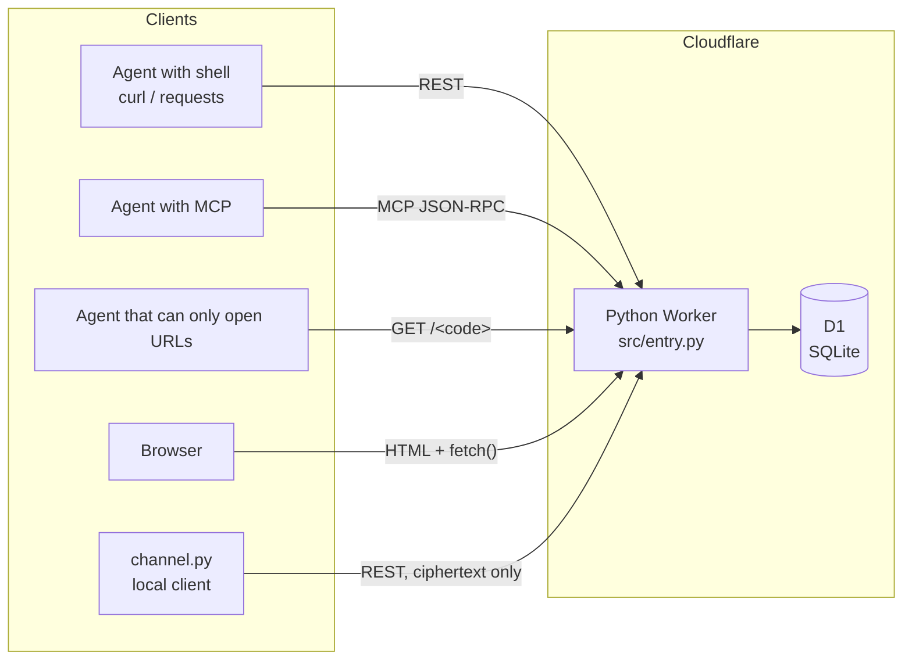
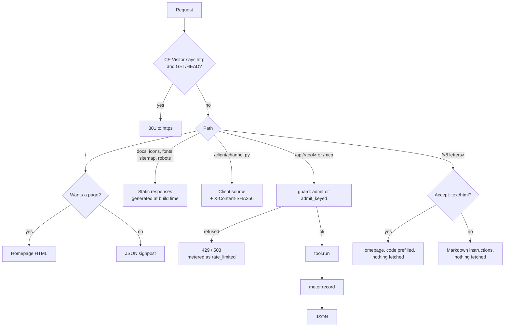
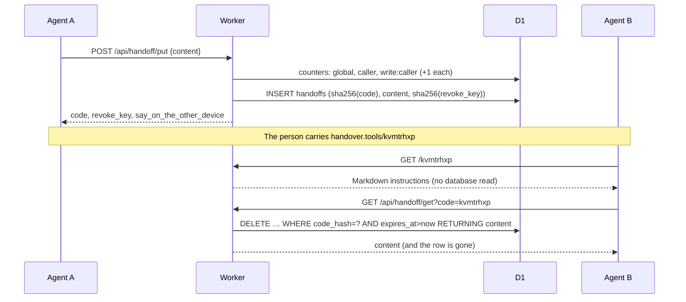
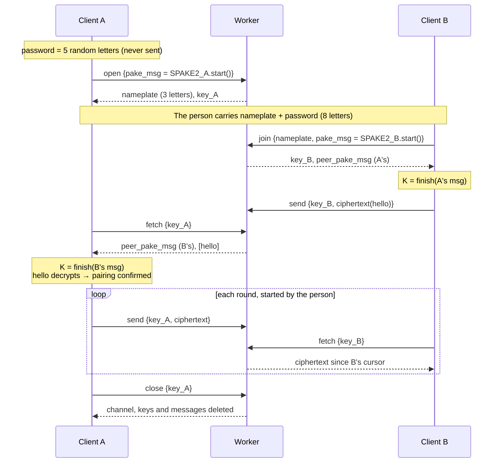

# System design

How handover.tools is built. The protocol contracts are in [`spec/handoff.md`](spec/handoff.md) and [`spec/channel.md`](spec/channel.md). The reasons behind the choices, and the alternatives that were rejected, are in [`decisions.md`](decisions.md), where the `Dxx` numbers used below are defined.

## 1. What it does

One agent stores a piece of work, and another agent picks it up. The person carries an 8-letter link between them. There are two modes:

| | One-shot (`handoff_*`) | Channel (`channel_*`) |
|---|---|---|
| Shape | Store one piece of text, fetch it once | Two paired agents exchange messages over several rounds |
| Server sees | **Plaintext** | Ciphertext and metadata only |
| Client needed | None: any HTTP client, MCP, or a browser | A local Python client that does the cryptography |

### Goals

- **Zero setup on the receiving side.** An agent that can open a URL can fetch. No account, no install, no prior configuration.
- **Cross-vendor.** Nothing depends on a particular agent product.
- **The server doesn't have to be trusted with channel content.** The server is run by one person with no company behind it, so the encrypted mode must not depend on that person's honesty (D26).
- **$0 hard ceiling on cost.** The service runs on Cloudflare's free plans, and abuse should make it unavailable rather than expensive.

### Non-goals

- Accounts, persistent storage, version history, comments. That is a workspace, a different product (D50).
- Automatic agent-to-agent loops. A person approves every channel send and starts every fetch (D25).
- Encrypting one-shot. A one-shot has no second party present at write time to run a key exchange with (D26).

## 2. Components



There is **one Worker, one D1 database, and nothing else**: no Durable Objects, queues, KV or cron (for why not KV, see D60). Every piece of state is a row in D1, and every operation is one HTTP request. With no push, nothing needs to stay in memory between requests.

| Module | Role |
|---|---|
| `src/entry.py` | Routing, content negotiation, REST and MCP dispatch, redirects |
| `src/registry.py` | The `@tool` decorator. The single source of REST routes, MCP `tools/list` and `/api/discover` |
| `src/tools/handoff.py` | The one-shot tools |
| `src/tools/channel.py` | The channel relay. It moves opaque bytes and contains no cryptography |
| `src/guard.py` | Quotas and the operator blocklist |
| `src/meter.py` | Per-call metering |
| `src/page.py`, `src/docs.py`, `src/style.py`, `src/icons.py` | The website: homepage, guide, security, terms, privacy and changelog pages, each also served as Markdown for LLMs |
| `scripts/build.sh` | Embeds the client, the fonts and images, and `CHANGELOG.md` into generated Python modules, because Python Workers only bundle `.py` files |
| `client/channel.py` | The local client: SPAKE2 pairing and ChaCha20-Poly1305. It is embedded in the Worker at build time and served at `/client/channel.py` |

### The registry: one definition, three surfaces

Each tool is one async function with metadata:

```python
@tool(name="handoff_get", title=..., summary=..., path="/api/handoff/get",
      input_schema={...}, keyed=False)
async def handoff_get(args, env): ...
```

From that single definition the Worker serves a REST endpoint (`GET` with query parameters or `POST` with a JSON body), an MCP tool (`tools/list`, `tools/call`), and an entry in `/api/discover`. The `summary` and `input_schema` descriptions are written for an LLM to read. They are the tool's documentation, and they can't drift from the implementation because they *are* the implementation's metadata.

## 3. Request pipeline



Points worth noting:

- **Content negotiation on `/`.** An explicit `application/json` gets the JSON signpost. `text/html` gets the page. Otherwise a `Mozilla` user agent gets the page and anything else (curl, wget, SDKs) gets JSON (D50). Responses carry `Vary: Accept, User-Agent`.
- **Code links never read the database.** `/<code>` returns instructions or a prefilled page. The actual read is a second request (D21, D38).
- **Existing paths are matched before code links.** Only a single path segment that normalizes to exactly 8 alphabet characters is treated as a code.
- **CORS is fully open.** Nothing is protected by origin: there are no cookies or sessions, and the code is the only credential (D21).
- **The caller's identity is the client IP** (`CF-Connecting-IP`). The tool can't override it: `_caller` is set by the Worker after parsing the arguments.

### Housekeeping without cron

Each Worker isolate runs four sweeps at most once every 10 minutes, at the start of a request: expired handoffs, expired channels, old counter buckets, and IP erasure in the metering table. Sweep errors are swallowed so they never fail the request. Reads also filter on `expires_at`, so an expired row that hasn't been swept yet is still never returned.

Schemas are created lazily with `CREATE TABLE IF NOT EXISTS` on the first request an isolate handles. The one migration so far (adding `handoffs.revoke_hash`) is an `ALTER TABLE` whose failure is ignored once the column exists.

## 4. Data model

Seven tables in one D1 database:

| Table | Holds | Key | Removed when |
|---|---|---|---|
| `handoffs` | One-shot content (plaintext), label, burn flag, read count, creator IP | `code_hash` = SHA-256 of the normalized code | Fetched (burn), revoked, or expired + swept |
| `channels` | Nameplate, both SPAKE2 messages, `next_seq`, per-side read cursors, expiry times, creator IP | random id | Closed by either side, or expired + swept |
| `channel_keys` | SHA-256 of each side's 130-bit key → channel and side | `key_hash` | With its channel |
| `channel_messages` | Ciphertext, sending side, server sequence number | `(channel_id, seq)` | With its channel |
| `counters` | Quota counters per scope and window | `(scope, window)` | Day buckets after 7 days, minute buckets after 10 minutes |
| `blocks` | Operator blocklist: an IP or prefix that may not write | `prefix` | By hand |
| `calls` | One row per API call: tool, transport, status, duration, caller IP | random id | The row stays; the IP is blanked after 30 days |

**Codes and keys are stored only as SHA-256 hashes.** A dump of D1 reveals no working code, channel key or revoke key. The codes have 5.5×10¹⁰ possibilities, so the hash protects against a casual dump, not against an attacker who is willing to brute-force a code offline. That is acceptable because a one-shot lives at most 24 hours and its content is in the same table anyway.

**Why D1 and not Durable Objects.** Every state change is one conditional SQL statement, and SQLite executes it atomically:

- read-once: `DELETE … RETURNING`
- consume a nameplate: `UPDATE … WHERE nameplate=? AND pake_b IS NULL … RETURNING`
- allocate a sequence number: `UPDATE … SET next_seq=next_seq+1 WHERE next_seq<200 … RETURNING`
- count against a quota: `INSERT … ON CONFLICT DO UPDATE SET n=n+1 RETURNING`

Durable Objects would add a component and no capability. Using a code (or its hash) as a DO name would also turn every wrong guess into a newly created object, which is unbounded resource use.

## 5. Flows

### 5.1 One-shot



### 5.2 Channel



The full protocol, including the key schedule, message format and the receiver's replay rules, is in [`spec/channel.md`](spec/channel.md).

## 6. Trust boundaries

| | One-shot | Channel |
|---|---|---|
| Content | Readable by the server | Ciphertext only. Keys are derived on the clients |
| The 8 letters | The whole code reaches the server | Only the 3-letter nameplate reaches the server. The 5-letter password never does |
| Metadata the server keeps | Size, label, times, read count, creator IP | Message count and sizes, times, which side sent each message, read cursors, creator IP |
| A malicious server could | Read and alter content | Drop, delay or reorder messages (the receiver detects this as gaps). It cannot read or forge content, and it cannot man-in-the-middle the pairing because it never learns the password |
| What still has to be trusted | The server | The client file. It is downloaded from the same server, so its sha256 is published (response header, `/api/discover`, `/security`) to be checked against this repository |

The server enforces none of the human-in-the-loop rules (approve before send, fetch only when asked). They live in the client's output and the agent instructions, and the docs never claim otherwise (D25).

## 7. Limits and capacity

| Gate | Default | Applies to | On refusal |
|---|---|---|---|
| Service-wide daily cap | 20,000 calls | Every tool call | HTTP 503 `service_daily_cap` |
| Per-caller daily calls | 200 | Unkeyed tools (`handoff_*`, `channel_open`, `channel_join`) | HTTP 429 `free_quota_exhausted` |
| Per-caller daily writes | 10 | `handoff_put`, `channel_open` | 200 with `reason: write_quota_exhausted`; reads unaffected |
| Keyed calls | not counted per caller | `channel_send/fetch/close` | Blocked only once the caller's 200 is used up. Wrong keys are charged to the caller, so guessing keys isn't free |
| Per-channel daily operations | 1,000 | Keyed calls on one channel | `channel_daily_ops_exhausted` |
| Operator blocklist | — | Writes only | `blocked` |

Counters are incremented before they are checked, so concurrent requests can't all slip past a limit. Day windows are UTC dates.

**Capacity, and why the global cap is 20,000.** The binding constraint is the Workers Free plan's D1 allowance of **100,000 rows written per day**. An ordinary call writes 3–4 rows: two counter upserts, one metering row, and usually one row the tool changes. `handoff_put` writes 5. So 20,000 calls a day is roughly 70,000–100,000 row writes, which stays at or under the allowance. Reads are cheap by comparison: quota checks are O(1) upserts, never `COUNT(*)`. The free plan also allows 100,000 Worker requests a day, which includes requests the caps refuse.

**Cost.** On the free plan, exceeding a limit returns errors and never produces a bill, so the service fails closed at $0. Cloudflare's paid plan has budget alerts but no hard spending cap, so the plan stays Free (D28).

## 8. Data lifecycle

| Data | Lifetime |
|---|---|
| One-shot content | Until fetched (default), revoked, or `ttl_minutes` (default 60, max 1440) |
| Channel, before pairing | 60 minutes from `open` |
| Channel, after pairing | 48 hours after the last send or fetch, never more than 7 days after `open` |
| Caller IP in `calls` | Blanked after 30 days; the row stays for statistics |
| Caller IP in `counters` | Day buckets deleted after 7 days |
| Creator IP on a handoff or channel | Deleted with the row |

D1 has point-in-time recovery, so a deleted row may survive in backups for a while. Public copy therefore says content becomes *unreadable*, not *destroyed*. For channels the stronger statement holds: the server never could read the content.

## 9. MCP

`POST /mcp` serves both protocol eras (D24):

- **Modern (2026-07-28).** No handshake. Each request declares its version in `params._meta` and mirrors it in the `MCP-Protocol-Version` header, along with `Mcp-Method` and, for tool calls, `Mcp-Name`. Mismatched headers return `-32020`. Unknown versions return `-32022`. Unknown methods return HTTP 404 with `-32601`. Batching is refused. Every result carries `resultType: "complete"`, and list results carry `ttlMs` and `cacheScope`.
- **Legacy (2025-11-25 and earlier).** The `initialize` handshake, with batching allowed.

A request counts as modern if it *uses the modern way of declaring a version* (the `_meta` key is present), not if the declared value is one the server recognizes. Getting this wrong let unknown versions slip into the legacy path (D24).

Tool results are returned both as `structuredContent` and as JSON text. A quota refusal is a successful JSON-RPC response with `isError: true`.

## 10. Failure modes

| Failure | Behavior |
|---|---|
| The global cap is reached | Every tool returns 503 until UTC midnight. Static pages and code links keep working because they don't touch the quota |
| A chat app previews a code link | Nothing happens. The preview gets instructions, and the code is only read by a second request |
| Two agents fetch the same code at once | One gets the content and the other gets `not_found_or_expired` (the single `DELETE … RETURNING`) |
| A client's response is lost after the server stored the message | The client has already saved its incremented counter, so a retry uses a new counter instead of being dropped as a replay |
| The server drops or reorders channel messages | The receiver sees a gap in sender counters and reports it |
| The server or storage alters a ciphertext | Decryption fails: `pairing_mismatch` before pairing is confirmed, `tampered` after. The client exits with code 3 |
| An agent base64-encodes plaintext into `channel_send` | Refused as `not_ciphertext` (D37). This prevents an accident; it doesn't stop a determined sender |
| Python's `urllib` calls the API | Cloudflare's managed bot rules return 403 (D19). The client sets its own User-Agent |

## 11. Known gaps

- **No edge rate limiting.** Every request that the caps refuse still runs the Worker. A Cloudflare rate-limiting rule in front of the Worker would be cheaper.
- **IP-based identity.** Anyone with many IPs can multiply the per-caller limits. Accounts would fix this, but they conflict with the zero-setup goal.
- **GET writes.** Every tool accepts GET with query parameters, `handoff_put` included, so content sent that way can end up in URL logs. The docs and examples only use POST for writes.
- **No third-party audit** of the cryptography or the client.
